### 在 Markdown 文件中、使用 Mermaid

只需使用 **三重反引號**（```）括住 Mermaid 語句，即可讓文件呈現圖表、具備視覺化效果。

````markdown
```mermaid

    %%Mermaid code

```
````

### 繪製流程圖

生成一個從左到右排列、A 指向 B、B 指向 C、C 指向的流程圖。

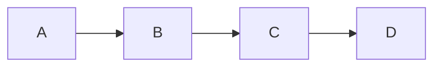

```markdown
graph LR;
    A-->B;
    B-->C;
    C-->D;
```

### 增加標籤與樣式

如果想要增加連結的標籤，可以使用 `|文字|` 來註解。

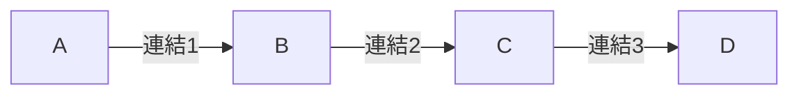

```markdown
graph LR;
    A-->|連結1|B;
    B-->|連結2|C;
    C-->|連結3|D;
```

### 使用不同形狀

可以使用 `style` 設定節點的樣式，圖表可以包含：

- `("文字")` 代表橢圓形
- `{"文字"}` 代表菱形
- `["文字"]` 代表矩形

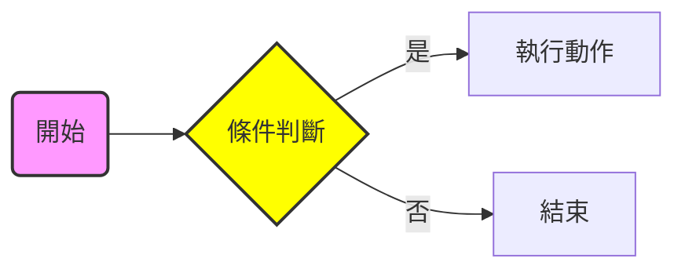

```markdown
graph LR;
style A fill:#f9f,stroke:#333,stroke-width:2px;
style B fill:#ff0,stroke:#333,stroke-width:2px;

    A("開始") --> B{"條件判斷"};
    B -->|是| C["執行動作"];
    B -->|否| D[結束];
```

### 也可由上至下繪製

使用 graph LR;（由左到右）、或 graph TD;（由上到下）來繪製流程圖。

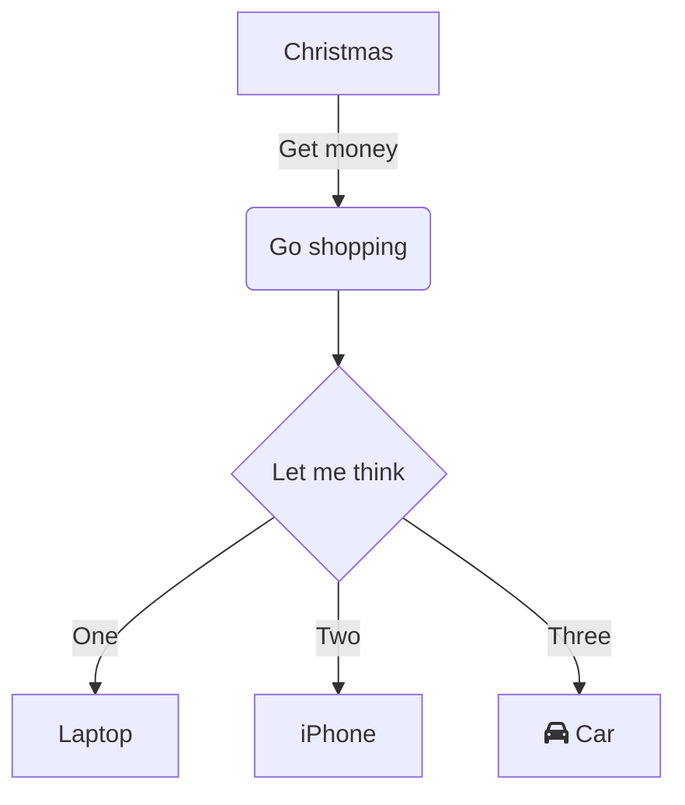

```markdown
flowchart TD
    A[Christmas] -->|Get money| B(Go shopping)
    B --> C{Let me think}
    C -->|One| D[Laptop]
    C -->|Two| E[iPhone]
    C -->|Three| F[fa:fa-car Car]
```

### 序列圖（Sequence Diagram）

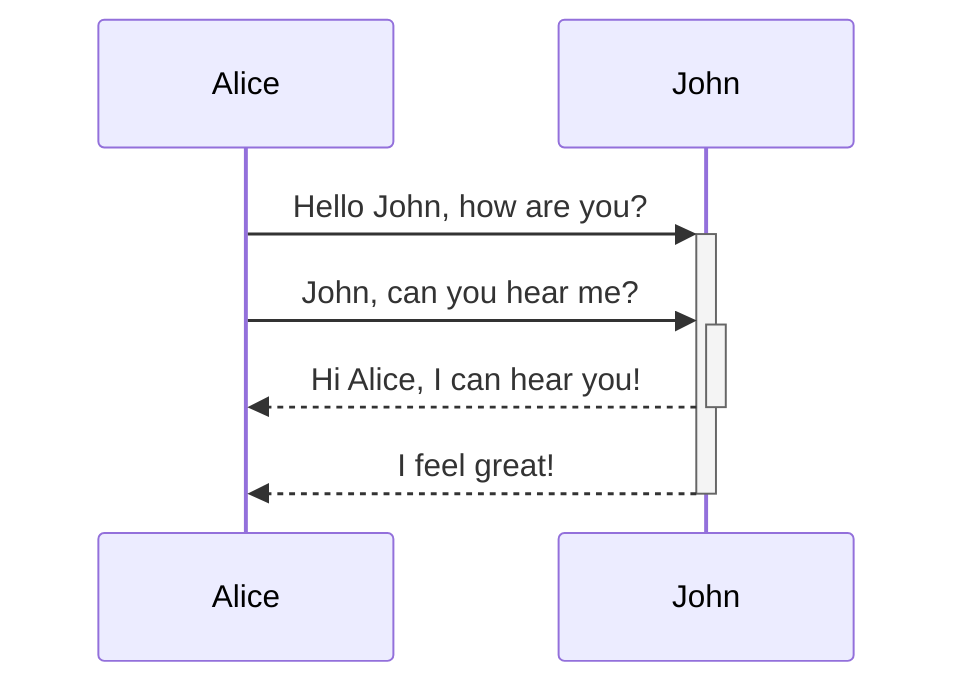

```markdown
sequenceDiagram
    Alice->>+John: Hello John, how are you?
    Alice->>+John: John, can you hear me?
    John-->>-Alice: Hi Alice, I can hear you!
    John-->>-Alice: I feel great!
```

### 甘特圖（Gantt Chart）

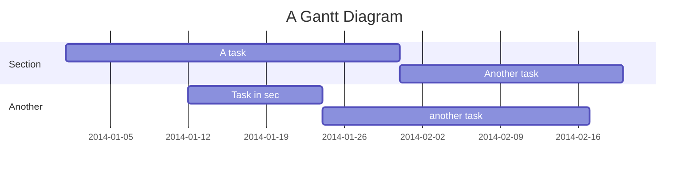

```markdown
gantt
    title A Gantt Diagram
    dateFormat  YYYY-MM-DD
    section Section
    A task           :a1, 2014-01-01, 30d
    Another task     :after a1  , 20d
    section Another
    Task in sec      :2014-01-12  , 12d
    another task      : 24d
```

### 類別圖（Class Diagram）

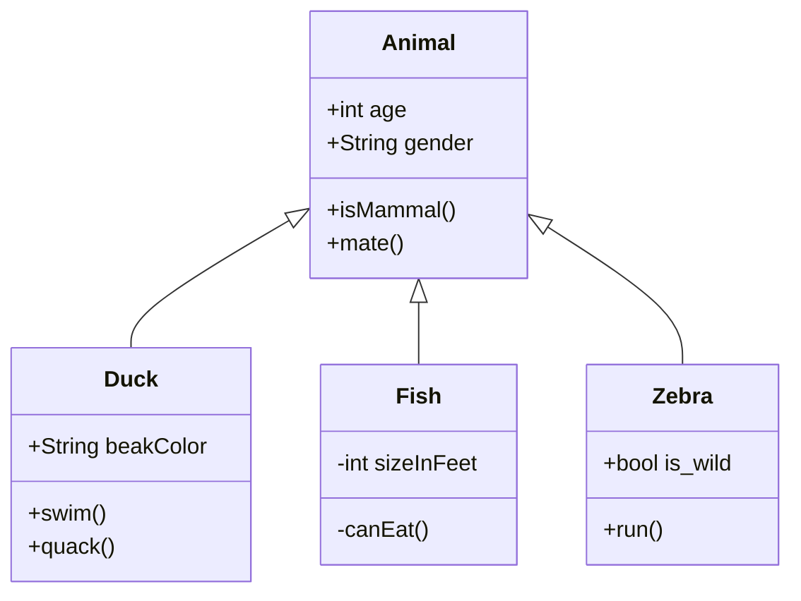

```markdown
classDiagram
    Animal <|-- Duck
    Animal <|-- Fish
    Animal <|-- Zebra
    Animal : +int age
    Animal : +String gender
    Animal: +isMammal()
    Animal: +mate()
    class Duck{
      +String beakColor
      +swim()
      +quack()
    }
    class Fish{
      -int sizeInFeet
      -canEat()
    }
    class Zebra{
      +bool is_wild
      +run()
    }
```

### 狀態圖（State Diagram）

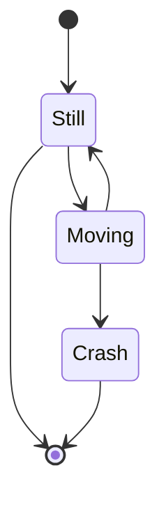

```markdown
stateDiagram-v2
    [*] --> Still
    Still --> [*]
    Still --> Moving
    Moving --> Still
    Moving --> Crash
    Crash --> [*]
```

### 餅圖（Pie Chart）

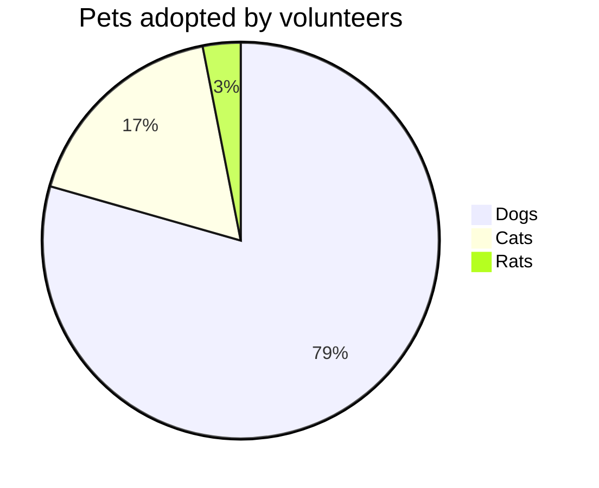

```markdown
pie title Pets adopted by volunteers
    "Dogs" : 386
    "Cats" : 85
    "Rats" : 15
```

### ER 圖（ER Chart）

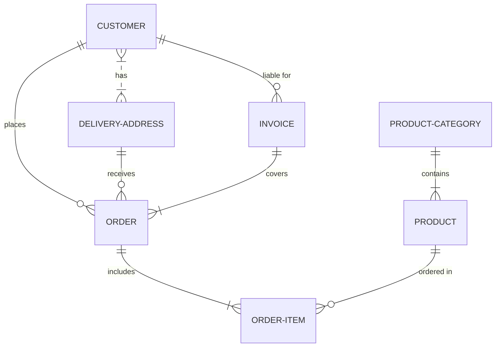

```markdown
erDiagram
    CUSTOMER }|..|{ DELIVERY-ADDRESS : has
    CUSTOMER ||--o{ ORDER : places
    CUSTOMER ||--o{ INVOICE : "liable for"
    DELIVERY-ADDRESS ||--o{ ORDER : receives
    INVOICE ||--|{ ORDER : covers
    ORDER ||--|{ ORDER-ITEM : includes
    PRODUCT-CATEGORY ||--|{ PRODUCT : contains
    PRODUCT ||--o{ ORDER-ITEM : "ordered in"
```

## Flowchart


## Sequence diagram

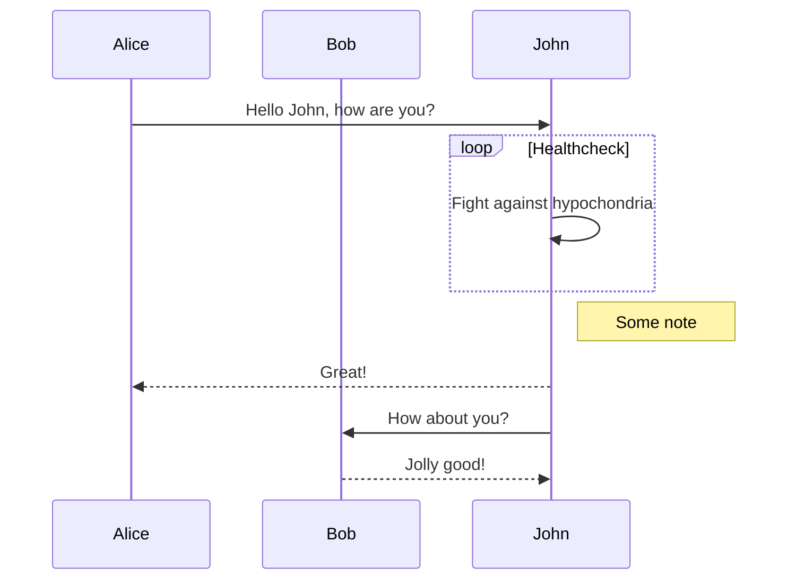

## Gantt diagram

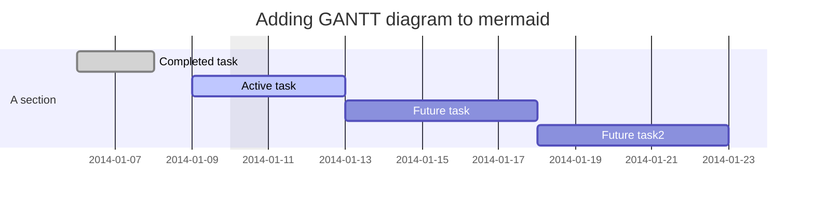

## Class diagram (experimental)

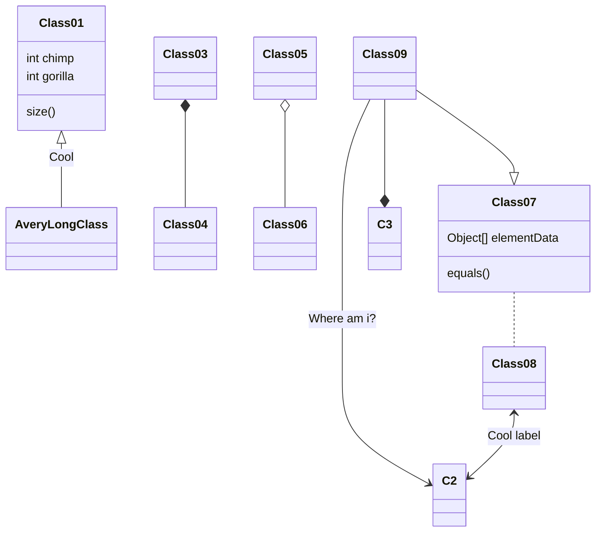

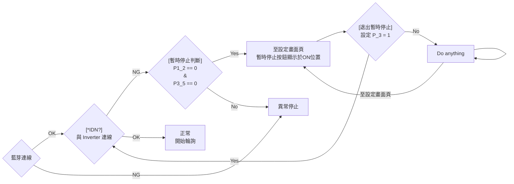

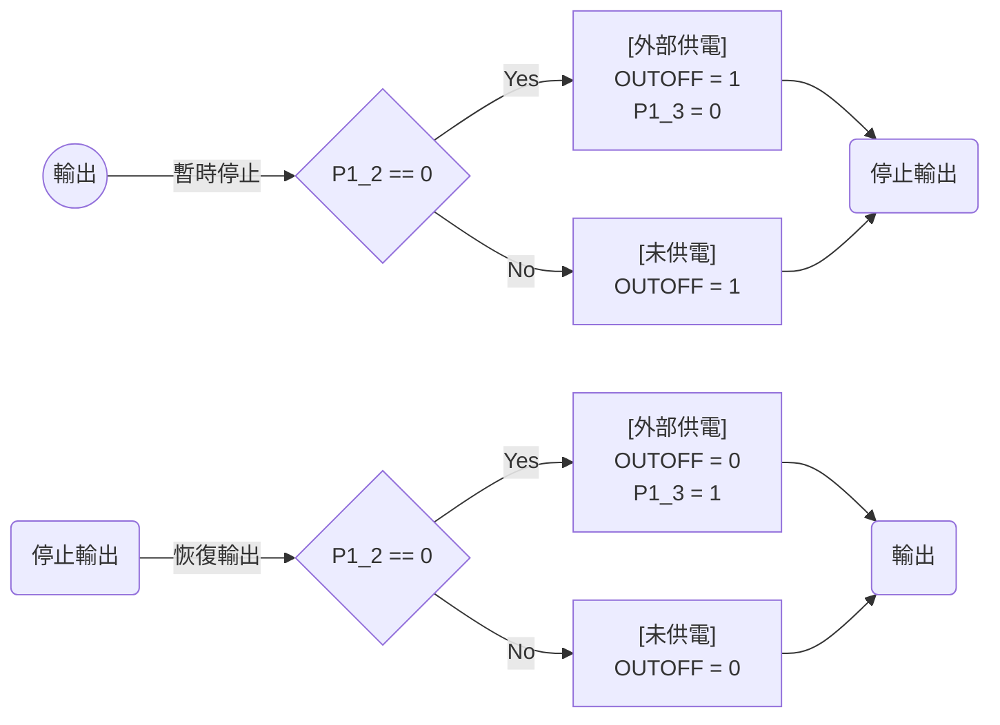
